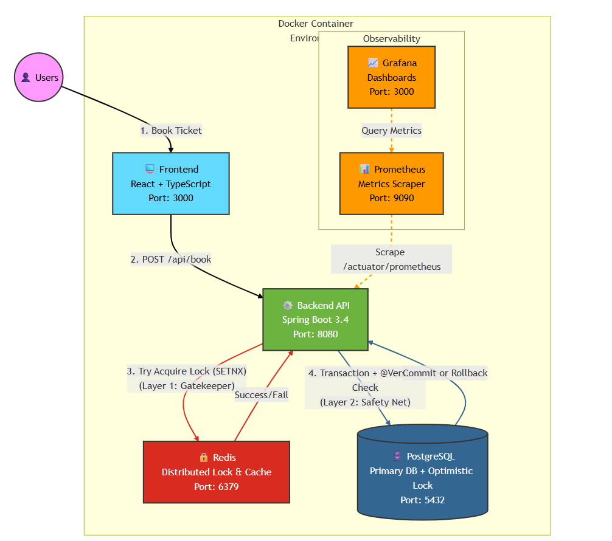

# ⚡ FlashTix – High-Performance Ticketing Engine

**FlashTix** is a full-stack, high‑throughput ticketing system designed for flash‑sale‑style traffic while guaranteeing **strict data consistency** and **no double booking**.

The engine uses a **defense‑in‑depth concurrency strategy** so that, even under thousands of concurrent requests, **exactly one user** can successfully book a given seat and all other requests are rejected with a clear `409 Conflict`.

---

## 📊 Proof of Work: Real-Time Observability

FlashTix doesn’t just “run”; it exposes rich metrics so you can **see** the concurrency behavior in real time.

| Metric                | Result           | Description                                                                 |
| :-------------------- | :-------------- | :-------------------------------------------------------------------------- |
| **Concurrency Load**  | **5000 Threads** (backend tests) / configurable via UI | Simulates thousands of users hitting `/book` at the same time.             |
| **Success Rate**      | **1 Booking**    | Only one user obtains the ticket for a given ID.                            |
| **Rejection Rate**    | **N‑1 Conflicts** | All other requests receive HTTP 409 (already booked / sold out).           |
| **Data Integrity**    | **100%**         | No race conditions, lost updates, or duplicate bookings detected.          |
| **Throughput**        | ~900 req/s+ (local test) | Measured during `ApiLoadTest` against a running instance.                  |

---

## 🏗️ System Architecture: Defense-in-Depth

Booking requests flow through several layers to protect the database and maintain correctness.

### 1. Redis Distributed Lock (Gatekeeper Layer)

- **Tech:** Redis with `SETNX` + expiry and atomic Lua scripts.
- **Role:** Per‑ticket mutex. Only one request per `ticketId` can proceed to the critical section at a time.
- **Details:**
  - Uses a **TTL** so locks auto‑expire if a node dies mid‑request.
  - Releases only if the same owner holds the lock (checked via Lua script).
  - Prevents thundering‑herd write load on Postgres.

### 2. Optimistic Locking with JPA (Database Guard)

- **Tech:** JPA `@Version` column on `Ticket`.
- **Role:** Final safety net at the database level.
- **Behavior:**
  - When two transactions try to update the same row, only the first commit succeeds.
  - Later commits see a stale version and fail with an optimistic locking exception, which is translated into HTTP `409 Conflict`.

### 3. Validation & Business Rules

- Checks ticket existence, current status (AVAILABLE / SOLD), and user constraints.
- Returns **meaningful HTTP errors**:
  - `404` if the ticket does not exist.
  - `409` if the ticket is already sold.
  - `500` for unexpected failures with a consistent JSON error envelope.

---

## 💻 Frontend: React Load Test Simulator

FlashTix includes a small React + TypeScript UI to visualize and experiment with concurrency.

Features:

- **Seat Grid:**  
  - Tickets are loaded from the backend.  
  - Colors reflect real‑time status (e.g., green = available, red = booked).  
  - After a booking or load test run, the UI refetches ticket data so colors update without manual refresh.

- **Load Test Simulator Panel:**
  - Input:
    - **Ticket ID** to target.
    - **Number of concurrent users**.
  - On **Start Load Test**:
    - The frontend fires concurrent requests to `/api/tickets/book`.
    - Results are summarized in a dashboard:
      - Total requests.
      - Success vs. conflicts.
      - Duration and calculated throughput.
      - The winner’s `userId`.

- **Error Handling:**
  - CORS is configured on the backend so the React dev server (port 3000/3001) can talk to the API.
  - Toasts display success, conflicts (“already booked”), and unexpected errors with friendly messages.

To run the frontend:

cd frontend
npm install
npm start
# React dev server on http://localhost:3000 or 3001
The React app expects the backend API URL via env var, for example:

bash
REACT_APP_API_URL=http://localhost:8080/api
✅ CI/CD & Testing
FlashTix is wired with a CI pipeline that builds and tests the backend on every push.

GitHub Actions:

Runs mvn clean test (and/or mvn verify) on Java 17.

Fails fast if:

Spring context cannot load for tests.

Concurrency invariants are violated (more than 1 success per ticket).

Backend Tests:

BackendApplicationTests: sanity check that the Spring context loads for the app.

TicketConcurrencyTest:

Boots the Spring context.

Fires thousands of concurrent booking calls in‑JVM.

Asserts:

Exactly one success.

All other attempts fail with conflict.

The winning ticket version is 1.

ApiLoadTest:

Targets a running server over HTTP.

Logs success / conflict counts and throughput.

Designed to match the behavior you see in Grafana.

Test Data Source:

Tests can be run either:

Against Dockerized Postgres/Redis (integration‑test style), or

Using an H2 test profile to make CI independent of external infrastructure.

🚀 Tech Stack
Language & Frameworks

Java 17

Spring Boot 3.4 (Web, Data JPA, Validation, Actuator)

Spring Data Redis

Frontend

React + TypeScript + Axios

Tailwind CSS / custom styling (depending on your current setup)

Data & Infrastructure

PostgreSQL 15 (via HikariCP connection pool)

Redis for distributed locking and caching

Docker & Docker Compose for Postgres, Redis, Prometheus, Grafana

Observability

Spring Boot Actuator + Micrometer

Prometheus scraping JVM and custom metrics (e.g. flashtix.sold.out)

Grafana dashboards for:

Request rate.

Lock contention.

DB pool metrics.

Error and conflict counts.

Testing

JUnit 5

Spring Boot Test

Dedicated concurrency and load tests.

🛠️ How to Run Locally
1. Start Infrastructure (Docker)
From the backend directory:

bash
docker compose up -d
# Starts Postgres, Redis, Prometheus, Grafana, etc.
2. Run the Backend
bash
cd backend
mvn spring-boot:run
# Backend on http://localhost:8080
3. Run the Frontend
bash
cd frontend
npm install
npm start
# React dev server on http://localhost:3000 (or 3001)
Make sure the frontend .env points to the backend:

bash
REACT_APP_API_URL=http://localhost:8080/api
🧪 Running Stress Tests
1. Seed the Database
Creates 100 fresh tickets (id 1..100):

bash
curl -X POST http://localhost:8080/api/tickets/seed
If the DB already has tickets, the endpoint responds accordingly and does not duplicate them.

2. Backend Load Test (in code)
From the backend module:

bash
# API-level load test
mvn test -Dtest=ApiLoadTest

# Concurrency test using Spring context
mvn test -Dtest=TicketConcurrencyTest
3. Frontend Load Test (UI)
Open the React app in your browser.

Use the Load Test Simulator:

Set a Ticket ID that is still available.

Choose number of concurrent users (e.g., 10, 100, 500).

Click Start Load Test and watch the results and seat colors update.

👨‍💻 Author
Mohd Arshad
Backend Engineer
LinkedIn

text

***

What’s one section you’d like to refine even more (architecture, tests, or frontend behavior)?
